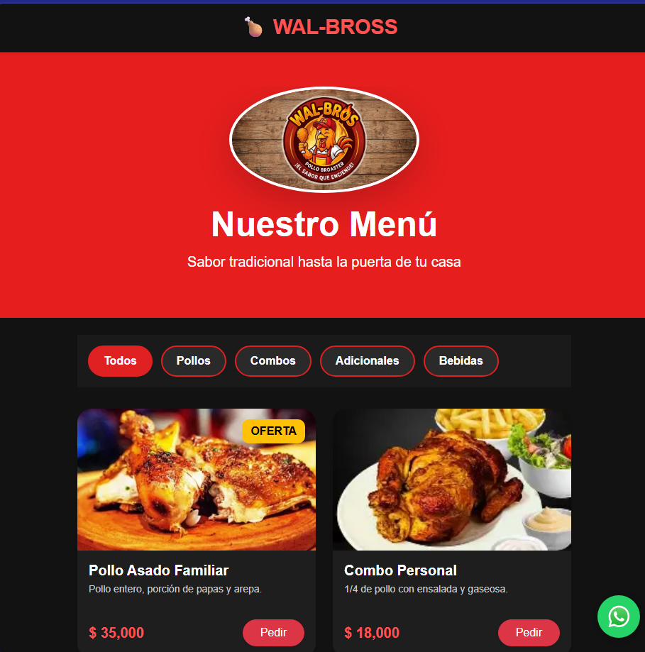
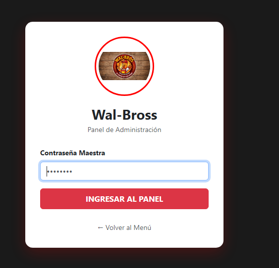
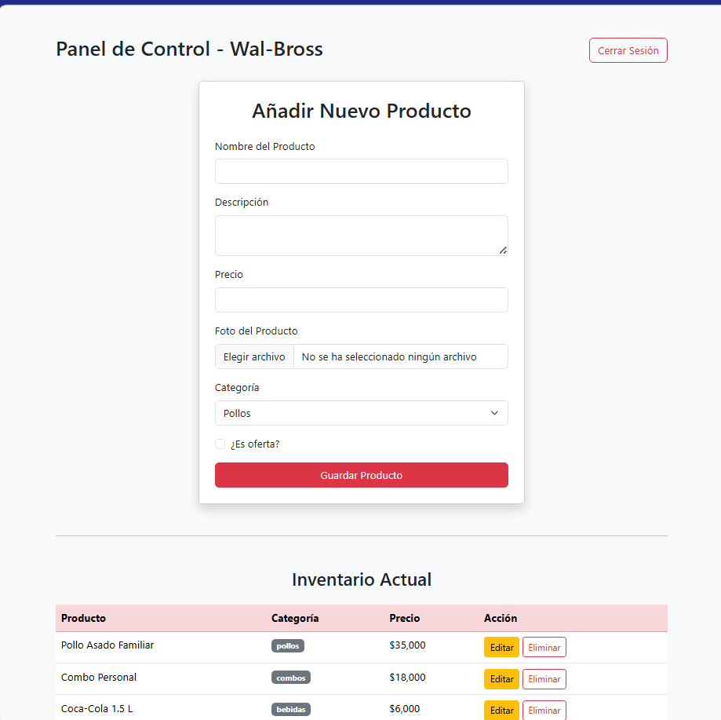

# 🐔 WalBross


WalBross es una plataforma web para mostrar y gestionar productos de manera sencilla y atractiva.  
Incluye filtrado por categorías, integración con WhatsApp para pedidos, un diseño moderno con tarjetas de producto y un Panel de Administración para gestionar el inventario.

## Características principales:
- **Catálogo dinámico**: tarjetas de producto con imágenes, precios y descripciones.
- **Filtrado por categorías**: botones interactivos que muestran solo los productos seleccionados.
- **Pedidos por WhatsApp**: integración directa para confirmar pedidos con un clic.
- **Diseño responsive**: estilos modernos y adaptables a diferentes pantallas.
- **Panel de Administración**:
  - Login seguro en `http://127.0.0.1:5000/login` con contraseña maestra.
  - Añadir nuevos productos con nombre, descripción, precio, foto y categoría.
  - Marcar productos como oferta.
  - Editar o eliminar productos del inventario actual.
  - Cerrar sesión para garantizar seguridad y control de acceso.

##  Estructura del proyecto:

WalBross/
│── app.py                 Aplicación principal Flask
│── .gitignore             Archivos ignorados por Git
│── static/                Archivos estáticos
│   ├── css/                Estilos
│   │   └── estilos.css
│   ├── js/                Lógica de filtrado y panel
│   │   └── main.js
│   ├── img/               Imágenes de productos
│   └── logo/              Logo del proyecto
│── templates/             Plantillas HTML
│   ├── base.html          Plantilla base
│   ├── index.html         Catálogo público
│   ├── login.html         Login administrador
│   ├── admin.html         Panel de administración
│   └── edit.html          Edición de productos
│── README.md              Documentación del proyecto


---

## ⚙️ Instalación y uso
1. Clonamos el repositorio:
   ```bash
   git clone https://github.com/ErwinArleycloud/WalBross.git
   
2. Instalar dependencias:
   Pip install flask

3. Ejecutamos la aplicaciom:
  python app.py usando ctrl + ñ en vs
   
4. Abrimos en nuestro navegador:
http://127.0.0.1:5000/login

## Cómo funciona

 Catálogo público:
-Los usuarios ven los productos en index.html.
-Pueden filtrar por categorías y hacer pedidos vía WhatsApp.

Panel de Administración:
-Solo accesible con contraseña maestra.
-Permite gestionar el inventario de la siguiente manera:
Añadiendo productos con foto, precio y categoría, Marcando productos como oferta.
Editando  o eliminando productos existentes.

- Los cambios se reflejan en el catálogo público.

Estilos visuales:
- style.css controla colores, tipografía y diseño responsive.
- El estado activo de los botones cambia el color de fondo a rojo (#df2121).

## Tecnologías utilizadas

**HTML5** para la estructura.
**CSS3** para estilos y diseño responsivo.
**JavaScript** para la lógica de filtrado, pedidos y administración.
**Flask (Python)** para el servidor y rutas.
**WhatsApp API** para la integración de pedidos.

## Próximas mejoras

Panel de administración con roles de usuario.
Optimización de rendimiento y accesibilidad.

## Capturas de pantalla

## Catalogo de productos


### Panel de Administracion - login


### Panel de Administracion - Inventario



## AUTOR
**Desarrollado por ERWIN ARLEY**
**📍San Juan de pasto, Colombia**

