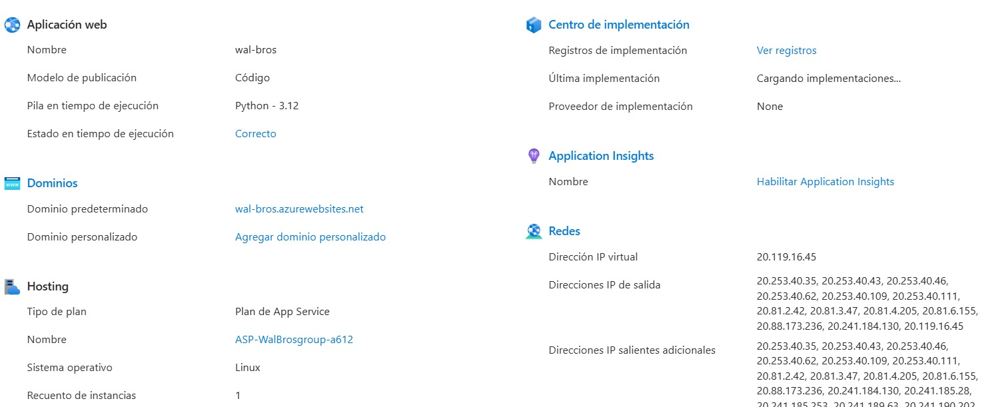
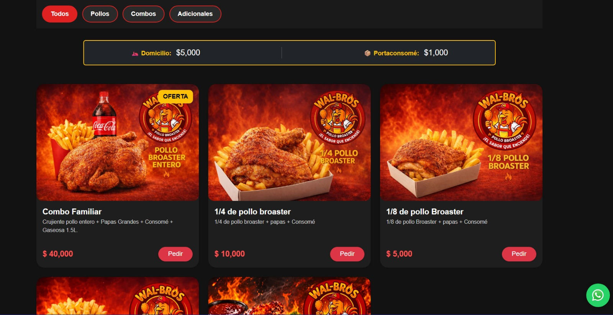
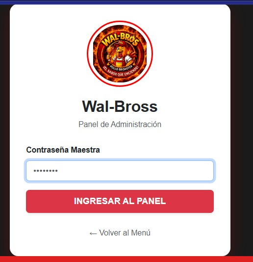
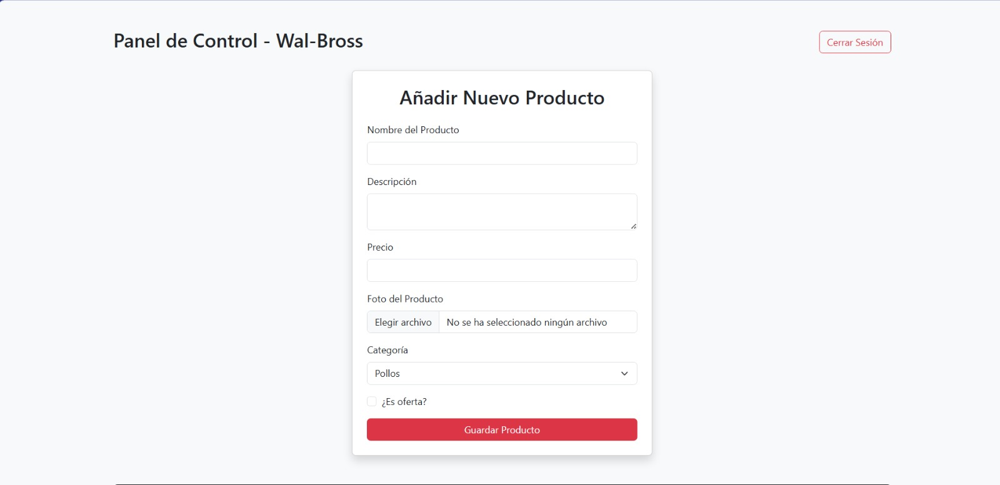

# 🐔 WalBross
# 🍗 WalBross - Gestión Comercial & Cloud Deployment


WalBross es una solución **Full Stack** diseñada para digitalizar la operación de un negocio real. Permite la gestión de inventarios en tiempo real, administración segura y conexión directa con clientes mediante WhatsApp.

## 🚀 Infraestructura y Cloud
A diferencia de proyectos locales, WalBross está configurado para entornos de producción en la nube:

* **Cloud Provider:** Microsoft Azure (App Service).
* **Pila Técnica:** Python 3.12 sobre Linux (Ubuntu Server).
* **Despliegue:** Configurado mediante `Procfile` y `web.config` para escalabilidad.

### ☁️ Evidencia de Configuración en Azure


---

## 🛠️ Características Principales
- **Catálogo Dinámico**: Filtrado inteligente por categorías.
- **Pedidos por WhatsApp**: Integración directa con API para confirmación de pedidos.
- **Panel de Administración**: 
  - Login seguro con contraseña maestra.
  - CRUD completo (Crear, Leer, Actualizar, Borrar) de productos.
  - Gestión de ofertas y estados de inventario.

## 📁 Estructura del Proyecto
```text
WalBross/
│── app.py               # Aplicación principal Flask
│── database.db          # Base de datos SQLite (Producción)
│── schema.sql           # Estructura de tablas SQL
│── requirements.txt     # Dependencias del proyecto (Flask, Gunicorn)
│── Procfile             # Configuración de proceso para Cloud
│── static/              # Archivos estáticos
│   ├── CSS/             # Estilos modernos y responsive
│   ├── img/             # Capturas de pantalla y media
│   └── js/              # Lógica de filtrado y administración
└── templates/           # Plantillas Jinja2 (HTML)
```

## ⚙️ Instalación y uso
1. **Clonamos el repositorio:**
   ```bash
   git clone https://github.com/ErwinArleycloud/WalBross.git
   ``` 

2. **Instalar dependencias:**
   ```bash
   pip install -r requirements.txt
   ``` 

3. **Ejecutamos la aplicación:**
   ```bash
   python app.py
   ``` 

## Cómo funciona

 Catálogo público:
-Pueden filtrar por categorías y hacer pedidos vía WhatsApp.

Panel de Administración:
-Solo accesible con contraseña maestra.
-Permite gestionar el inventario de la siguiente manera:
Añadiendo productos con foto, precio y categoría, Marcando productos como oferta.
Editando  o eliminando productos existentes.

- Los cambios se reflejan en el catálogo público.

Estilos visuales:
- style.css controla colores, tipografía y diseño responsive.
- El estado activo de los botones cambia el color de fondo a rojo (#df2121).

## Tecnologías utilizadas

**HTML5** para la estructura.
**CSS3** para estilos y diseño responsivo.
**JavaScript** para la lógica de filtrado, pedidos y administración.
**Flask (Python)** para el servidor y rutas.
**WhatsApp API** para la integración de pedidos.

## Próximas mejoras


Optimización de rendimiento y accesibilidad.

## Capturas de pantalla

## URL en google


## Catalogo de productos


### Panel de Administracion - login


### Panel de Administracion - control



## AUTOR
**Desarrollado por ERWIN ARLEY**
**📍San Juan de pasto, Colombia**

